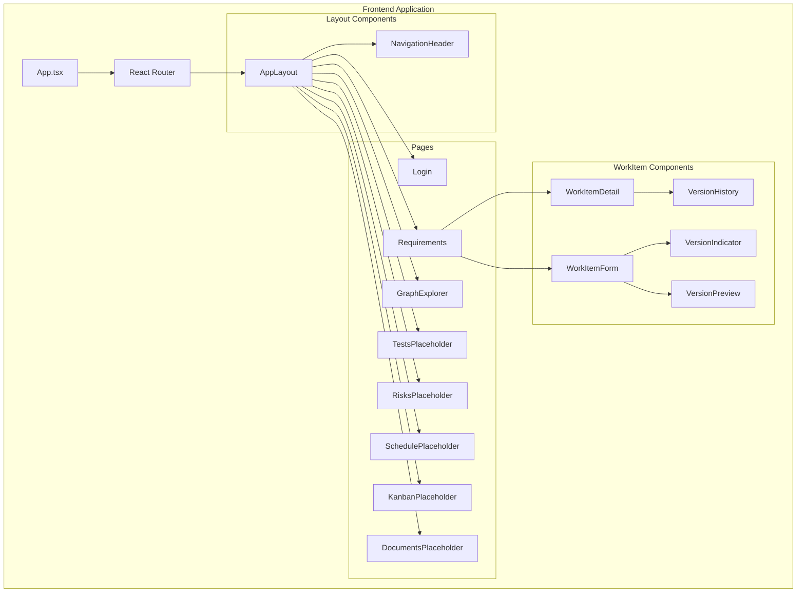
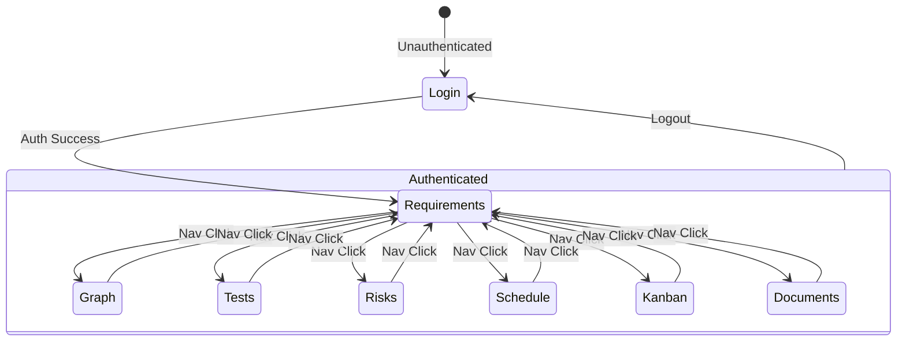

# Design Document: Frontend Navigation and Versioning

## Overview

This design document describes the technical implementation for enhancing the RxDx frontend application with comprehensive navigation, routing, and improved version control user experience. The implementation focuses on frontend-only changes, leveraging existing backend APIs and connecting existing but unrouted components.

The design follows React best practices with TypeScript, using React Router for navigation, Zustand for state management, and component-based architecture. All changes maintain consistency with the existing codebase patterns found in the RxDx frontend.

## Architecture

### High-Level Architecture



### Navigation Flow



## Components and Interfaces

### NavigationHeader Component

The NavigationHeader component replaces the inline header in AppLayout with a dedicated navigation component.

```typescript
interface NavItem {
  path: string;
  label: string;
  icon?: string;
}

interface NavigationHeaderProps {
  user: User | null;
  onLogout: () => void;
}

const navItems: NavItem[] = [
  { path: '/requirements', label: 'Requirements', icon: '📋' },
  { path: '/graph', label: 'Graph', icon: '🔗' },
  { path: '/tests', label: 'Tests', icon: '🧪' },
  { path: '/risks', label: 'Risks', icon: '⚠️' },
  { path: '/schedule', label: 'Schedule', icon: '📅' },
  { path: '/kanban', label: 'Kanban', icon: '📊' },
  { path: '/documents', label: 'Documents', icon: '📄' },
];
```

**Responsibilities:**
- Render navigation links for all pages
- Show active state for current route using `useLocation` hook
- Handle responsive collapse for mobile screens
- Display user info and logout button

### PlaceholderPage Component

A reusable component for pages under development.

```typescript
interface PlaceholderPageProps {
  title: string;
  description: string;
  icon?: string;
  relatedRequirement?: string;
}
```

**Responsibilities:**
- Display page title with icon
- Show "Coming Soon" message
- Display feature description
- Provide navigation back to Requirements

### VersionIndicator Component

A new component to display version information in forms.

```typescript
interface VersionIndicatorProps {
  version: string;
  className?: string;
}
```

**Responsibilities:**
- Display current version number in badge format
- Use consistent styling with existing badges

### VersionPreview Component

A new component to show versioning implications before save.

```typescript
interface VersionPreviewProps {
  currentVersion?: string;
  isNewItem: boolean;
  className?: string;
}
```

**Responsibilities:**
- Calculate and display next version number
- Show informational message about version creation
- Handle both new items (v1.0) and edits (increment)

### Updated WorkItemForm Component

Modifications to the existing WorkItemForm:

```typescript
interface WorkItemFormProps {
  item?: WorkItem;
  onSuccess?: (item: WorkItem) => void;
  onCancel?: () => void;
  defaultType?: WorkItemType;
}
```

**Changes:**
- Add VersionIndicator when editing existing item
- Add VersionPreview near submit button
- Update button text: "Create Work Item" vs "Save Changes"

### Updated WorkItemDetail Component

Modifications to the existing WorkItemDetail:

```typescript
interface WorkItemDetailProps {
  workItemId: string;
  onEdit?: (item: WorkItem) => void;
  onDelete?: (item: WorkItem) => void;
  onClose?: () => void;
  onViewHistory?: (item: WorkItem) => void;
  showActions?: boolean;
}
```

**Changes:**
- Enhance version badge visibility
- Add version count indicator
- Make "View History" more prominent

### Route Configuration

```typescript
const routes = [
  { path: '/login', element: <Login />, protected: false },
  { path: '/requirements', element: <Requirements />, protected: true },
  { path: '/graph', element: <GraphExplorer />, protected: true },
  { path: '/tests', element: <TestsPlaceholder />, protected: true },
  { path: '/risks', element: <RisksPlaceholder />, protected: true },
  { path: '/schedule', element: <SchedulePlaceholder />, protected: true },
  { path: '/kanban', element: <KanbanPlaceholder />, protected: true },
  { path: '/documents', element: <DocumentsPlaceholder />, protected: true },
  { path: '/', element: <Navigate to="/requirements" />, protected: true },
  { path: '*', element: <Navigate to="/" />, protected: false },
];
```

## Data Models

### Navigation State

No new stores required. Navigation state is managed by React Router's built-in hooks:

```typescript
// Using existing React Router hooks
const location = useLocation();  // Current route
const navigate = useNavigate();  // Programmatic navigation
```

### Version Calculation

Version numbers follow semantic versioning pattern (major.minor):

```typescript
interface VersionInfo {
  current: string;      // e.g., "1.2"
  next: string;         // e.g., "1.3"
  isNew: boolean;       // true if creating new item
  totalVersions: number; // count of all versions
}

function calculateNextVersion(currentVersion: string): string {
  const [major, minor] = currentVersion.split('.').map(Number);
  return `${major}.${minor + 1}`;
}

function parseVersion(version: string): { major: number; minor: number } {
  const [major, minor] = version.split('.').map(Number);
  return { major: major || 1, minor: minor || 0 };
}
```

### Existing Data Models (No Changes)

The following existing models are used without modification:

```typescript
// From workitemService.ts
interface WorkItem {
  id: string;
  type: WorkItemType;
  title: string;
  description?: string;
  status: WorkItemStatus;
  priority?: number;
  version: string;
  is_signed: boolean;
  created_by: string;
  assigned_to?: string;
  created_at: string;
  updated_at: string;
}

interface VersionHistoryItem {
  version: string;
  title: string;
  status: string;
  change_description?: string;
  created_by: string;
  created_at: string;
}
```


## Correctness Properties

*A property is a characteristic or behavior that should hold true across all valid executions of a system—essentially, a formal statement about what the system should do. Properties serve as the bridge between human-readable specifications and machine-verifiable correctness guarantees.*

### Property 1: Navigation Links Presence

*For any* NavigationHeader component render, all seven navigation links (Requirements, Graph, Tests, Risks, Schedule, Kanban, Documents) SHALL be present in the rendered output.

**Validates: Requirements 1.1**

### Property 2: Navigation Click Behavior

*For any* valid navigation path in the navItems array, clicking the corresponding link SHALL trigger navigation to that exact path.

**Validates: Requirements 1.2**

### Property 3: Active State Indicator

*For any* current route that matches a navigation item path, that navigation item SHALL have the active state class applied, and no other navigation items SHALL have the active state.

**Validates: Requirements 1.3**

### Property 4: Header Visibility on Authenticated Routes

*For any* authenticated route (all routes except /login), the NavigationHeader component SHALL be rendered when the user is authenticated.

**Validates: Requirements 1.5**

### Property 5: Unknown Route Redirect

*For any* route path that does not match a defined route, the system SHALL redirect to the default authenticated page (/requirements for authenticated users, /login for unauthenticated).

**Validates: Requirements 2.8**

### Property 6: Route Protection

*For any* protected route (all routes except /login), accessing the route without authentication SHALL redirect to /login.

**Validates: Requirements 2.9**

### Property 7: Placeholder Page Content Rendering

*For any* PlaceholderPage component with a given title and description, the rendered output SHALL contain the title, the "Coming Soon" message, and the description text.

**Validates: Requirements 3.1, 3.2, 3.3**

### Property 8: Button Text Based on Edit Mode

*For any* WorkItemForm render with an existing item (edit mode), the submit button text SHALL be "Save Changes". *For any* WorkItemForm render without an existing item (create mode), the submit button text SHALL be "Create Work Item". This SHALL hold regardless of WorkItem type.

**Validates: Requirements 5.2, 5.4**

### Property 9: Version Indicator on Edit

*For any* WorkItemForm rendered in edit mode with an existing WorkItem, the current version number from the WorkItem SHALL be displayed in a VersionIndicator component.

**Validates: Requirements 6.1**

### Property 10: Version Preview on Edit

*For any* WorkItemForm rendered in edit mode, a VersionPreview component SHALL be displayed showing the next version that will be created.

**Validates: Requirements 7.1**

### Property 11: Next Version Calculation

*For any* valid version string in format "major.minor", the calculateNextVersion function SHALL return a string with the same major number and minor incremented by 1.

**Validates: Requirements 7.3**

### Property 12: Version Badge Display

*For any* WorkItemDetail component rendered with a WorkItem, the version number SHALL be displayed in a badge element.

**Validates: Requirements 8.1**

### Property 13: View History Visibility

*For any* WorkItemDetail component rendered with a WorkItem that has version history available, a "View History" action SHALL be visible and clickable.

**Validates: Requirements 8.3, 9.3**

### Property 14: Version Count Display

*For any* WorkItemDetail component rendered with version history data, the total version count SHALL be displayed.

**Validates: Requirements 9.1**

### Property 15: Multiple Versions Timeline

*For any* VersionHistory component rendered with more than one version, a timeline indicator SHALL be displayed showing version progression.

**Validates: Requirements 9.2**

### Property 16: Current Version Highlighting

*For any* VersionHistory component rendered with a selected/current version, that version entry SHALL have a distinct visual highlight (selected class) applied.

**Validates: Requirements 9.4**

### Property 17: Change Description Display

*For any* version entry in VersionHistory that has a non-empty change_description, that description SHALL be rendered in the version item.

**Validates: Requirements 9.5**

## Error Handling

### Navigation Errors

| Error Scenario | Handling Strategy |
|----------------|-------------------|
| Invalid route accessed | Redirect to default page (/ which redirects to /requirements or /login) |
| Authentication expired during navigation | Redirect to /login with return URL preserved |
| Navigation component fails to render | ErrorBoundary catches and displays fallback UI |

### Version Display Errors

| Error Scenario | Handling Strategy |
|----------------|-------------------|
| Version string malformed | Display raw version string, log warning |
| Version history fetch fails | Display error message with retry button |
| Version calculation overflow | Cap at reasonable maximum (99.99) |

### Graph Explorer Errors

| Error Scenario | Handling Strategy |
|----------------|-------------------|
| Graph data fetch fails | Display error banner with retry option |
| WebGL not supported (3D mode) | Gracefully degrade to 2D mode with notification |
| Graph rendering timeout | Show loading timeout message, offer refresh |

### Form Submission Errors

| Error Scenario | Handling Strategy |
|----------------|-------------------|
| Version conflict on save | Display conflict message, offer to reload |
| Network error during save | Show error, preserve form data, allow retry |
| Validation error | Display field-level errors, prevent submission |

## Testing Strategy

### Unit Testing Approach

Unit tests focus on specific examples, edge cases, and component isolation:

- **NavigationHeader**: Test link rendering, active state logic, responsive behavior
- **PlaceholderPage**: Test content rendering with various props
- **VersionIndicator**: Test version display formatting
- **VersionPreview**: Test next version calculation display
- **WorkItemForm**: Test button text logic, version indicator presence
- **WorkItemDetail**: Test version badge rendering, history link visibility

### Property-Based Testing Approach

Property tests verify universal properties across generated inputs using a property-based testing library (e.g., fast-check for TypeScript).

**Configuration:**
- Minimum 100 iterations per property test
- Each test tagged with: **Feature: frontend-navigation-and-versioning, Property {N}: {description}**

**Key Properties to Test:**

1. **Version Calculation Property** (Property 11)
   - Generate random valid version strings
   - Verify calculateNextVersion always increments minor version
   - Verify major version is preserved

2. **Active State Property** (Property 3)
   - Generate random route from valid routes
   - Verify exactly one nav item has active state
   - Verify active item matches current route

3. **Route Protection Property** (Property 6)
   - Generate random protected routes
   - Verify unauthenticated access redirects to login

4. **Button Text Property** (Property 8)
   - Generate random WorkItem types
   - Generate random edit/create modes
   - Verify button text matches expected value

### Test File Organization

```
frontend/src/
├── components/
│   ├── common/
│   │   └── NavigationHeader.test.tsx
│   ├── workitems/
│   │   ├── WorkItemForm.test.tsx (update existing)
│   │   ├── WorkItemDetail.test.tsx (new)
│   │   ├── VersionIndicator.test.tsx (new)
│   │   └── VersionPreview.test.tsx (new)
├── pages/
│   ├── PlaceholderPage.test.tsx (new)
│   └── GraphExplorer.test.tsx (update existing)
└── utils/
    └── versionUtils.test.tsx (new - property tests)
```

### Test Commands

```bash
# Run all tests silently
npm test -- --silent

# Run specific component tests
npm test -- --testPathPattern="NavigationHeader" --silent

# Run property tests
npm test -- --testPathPattern="versionUtils" --silent

# Run with coverage
npm test -- --coverage --silent
```

