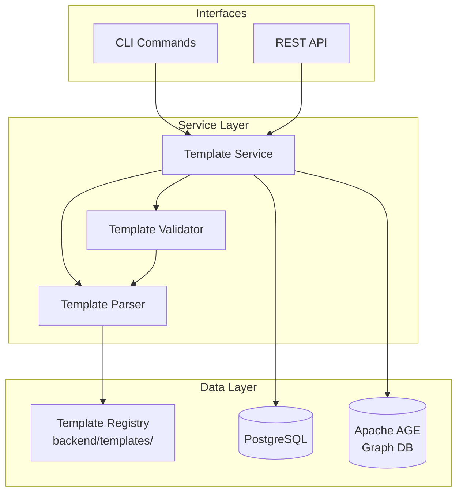

# Design Document: Project Templating

## Overview

The Project Templating system provides a unified approach to seed data management for the RxDx application. It replaces the dual-source approach (SQL file + Python script) with a single YAML-based template system that supports multiple project types, non-destructive application, and idempotent operations.

The system consists of three main components:
1. **Template Parser**: Loads and validates YAML template files against a JSON Schema
2. **Template Service**: Orchestrates template discovery, validation, and application
3. **Template CLI/API**: Provides interfaces for template management operations

## Architecture



## Components and Interfaces

### Template Parser

Responsible for loading and parsing YAML template files.

```python
from pathlib import Path
from typing import Optional
from pydantic import BaseModel

class TemplateParser:
    """Parses YAML template files into structured data."""
    
    def __init__(self, templates_dir: Path):
        self.templates_dir = templates_dir
    
    def load_template(self, name: str) -> "TemplateDefinition":
        """Load a template by name from the templates directory."""
        ...
    
    def list_templates(self) -> list["TemplateMetadata"]:
        """List all available templates with metadata only."""
        ...
    
    def validate_yaml(self, content: str) -> tuple[bool, list[str]]:
        """Validate YAML syntax and return errors if any."""
        ...
```

### Template Validator

Validates template content against schema and business rules.

```python
class TemplateValidator:
    """Validates template definitions against schema and business rules."""
    
    def __init__(self, schema_path: Path):
        self.schema = self._load_schema(schema_path)
    
    def validate_schema(self, template: dict) -> list["ValidationError"]:
        """Validate template against JSON Schema."""
        ...
    
    def validate_references(self, template: "TemplateDefinition") -> list["ValidationError"]:
        """Validate that all user/workitem references are resolvable."""
        ...
    
    def validate_constraints(self, template: "TemplateDefinition") -> list["ValidationError"]:
        """Validate field constraints (priority ranges, email formats, etc.)."""
        ...
```

### Template Service

Main service orchestrating template operations.

```python
class TemplateService:
    """Orchestrates template discovery, validation, and application."""
    
    def __init__(
        self,
        parser: TemplateParser,
        validator: TemplateValidator,
        db_session: AsyncSession,
        graph_service: GraphService
    ):
        ...
    
    async def list_templates(self) -> list["TemplateMetadata"]:
        """List all available templates."""
        ...
    
    async def get_template(self, name: str) -> Optional["TemplateDefinition"]:
        """Get a template by name with full content."""
        ...
    
    async def apply_template(
        self,
        name: str,
        dry_run: bool = False
    ) -> "ApplicationResult":
        """Apply a template to the database."""
        ...
    
    async def validate_template(self, name: str) -> "ValidationResult":
        """Validate a template without applying it."""
        ...
```

### REST API Endpoints

```python
from fastapi import APIRouter, Depends, HTTPException

router = APIRouter(prefix="/api/v1/templates", tags=["templates"])

@router.get("/")
async def list_templates() -> list[TemplateMetadataResponse]:
    """List all available templates."""
    ...

@router.get("/{name}")
async def get_template(name: str) -> TemplateDetailResponse:
    """Get template details by name."""
    ...

@router.post("/{name}/apply")
async def apply_template(
    name: str,
    dry_run: bool = False,
    current_user: User = Depends(require_admin)
) -> ApplicationResultResponse:
    """Apply a template to the database."""
    ...

@router.post("/{name}/validate")
async def validate_template(name: str) -> ValidationResultResponse:
    """Validate a template without applying."""
    ...
```

### CLI Commands

```python
import typer

app = typer.Typer()

@app.command()
def list(format: str = "table"):
    """List available templates."""
    ...

@app.command()
def apply(name: str, dry_run: bool = False):
    """Apply a template to the database."""
    ...

@app.command()
def validate(name: str):
    """Validate a template file."""
    ...
```

## Data Models

### Template Definition Schema

```yaml
# Template file structure (backend/templates/{name}.yaml)
metadata:
  name: string          # Template identifier (kebab-case)
  version: string       # Semantic version (e.g., "1.0.0")
  description: string   # Human-readable description
  author: string        # Template author
  
settings:
  default_password: string  # Default password for all users (hashed on apply)
  
users:
  - id: string          # UUID or template-local identifier
    email: string       # User email (unique)
    full_name: string   # Display name
    role: string        # admin|project_manager|validator|auditor|user
    is_active: boolean  # Account status (default: true)
    password: string    # Optional override of default_password

workitems:
  requirements:
    - id: string
      title: string
      description: string
      status: string    # draft|active|completed|archived
      priority: integer # 1-5
      acceptance_criteria: string
      business_value: string
      source: string
      created_by: string  # Reference to user id
      
  tasks:
    - id: string
      title: string
      description: string
      status: string
      priority: integer
      estimated_hours: number
      actual_hours: number
      assigned_to: string  # Reference to user id
      created_by: string
      
  tests:
    - id: string
      title: string
      description: string
      status: string
      priority: integer
      test_type: string   # unit|integration|system|acceptance
      test_steps: string
      expected_result: string
      test_status: string # not_run|passed|failed|blocked
      assigned_to: string
      created_by: string
      
  risks:
    - id: string
      title: string
      description: string
      status: string
      priority: integer
      severity: integer   # 1-10
      occurrence: integer # 1-10
      detection: integer  # 1-10
      mitigation_actions: string
      risk_owner: string  # Reference to user id
      created_by: string

relationships:
  - from_id: string     # Source workitem id
    to_id: string       # Target workitem id
    type: string        # IMPLEMENTS|TESTED_BY|MITIGATES|DEPENDS_ON
```

### Pydantic Models

```python
from pydantic import BaseModel, Field, EmailStr
from typing import Optional
from uuid import UUID
from enum import Enum

class UserRole(str, Enum):
    ADMIN = "admin"
    PROJECT_MANAGER = "project_manager"
    VALIDATOR = "validator"
    AUDITOR = "auditor"
    USER = "user"

class RelationshipType(str, Enum):
    IMPLEMENTS = "IMPLEMENTS"
    TESTED_BY = "TESTED_BY"
    MITIGATES = "MITIGATES"
    DEPENDS_ON = "DEPENDS_ON"

class TemplateMetadata(BaseModel):
    name: str = Field(..., pattern=r"^[a-z][a-z0-9-]*$")
    version: str = Field(..., pattern=r"^\d+\.\d+\.\d+$")
    description: str
    author: str

class TemplateUser(BaseModel):
    id: str
    email: EmailStr
    full_name: str
    role: UserRole
    is_active: bool = True
    password: Optional[str] = None

class TemplateRequirement(BaseModel):
    id: str
    title: str = Field(..., min_length=5, max_length=500)
    description: Optional[str] = None
    status: str = "draft"
    priority: int = Field(..., ge=1, le=5)
    acceptance_criteria: Optional[str] = None
    business_value: Optional[str] = None
    source: Optional[str] = None
    created_by: str

class TemplateTask(BaseModel):
    id: str
    title: str = Field(..., min_length=5, max_length=500)
    description: Optional[str] = None
    status: str = "draft"
    priority: int = Field(..., ge=1, le=5)
    estimated_hours: Optional[float] = None
    actual_hours: Optional[float] = None
    assigned_to: Optional[str] = None
    created_by: str

class TemplateTest(BaseModel):
    id: str
    title: str = Field(..., min_length=5, max_length=500)
    description: Optional[str] = None
    status: str = "draft"
    priority: int = Field(..., ge=1, le=5)
    test_type: Optional[str] = None
    test_steps: Optional[str] = None
    expected_result: Optional[str] = None
    test_status: str = "not_run"
    assigned_to: Optional[str] = None
    created_by: str

class TemplateRisk(BaseModel):
    id: str
    title: str = Field(..., min_length=5, max_length=500)
    description: Optional[str] = None
    status: str = "draft"
    priority: int = Field(..., ge=1, le=5)
    severity: int = Field(..., ge=1, le=10)
    occurrence: int = Field(..., ge=1, le=10)
    detection: int = Field(..., ge=1, le=10)
    mitigation_actions: Optional[str] = None
    risk_owner: Optional[str] = None
    created_by: str

class TemplateRelationship(BaseModel):
    from_id: str
    to_id: str
    type: RelationshipType

class TemplateWorkitems(BaseModel):
    requirements: list[TemplateRequirement] = []
    tasks: list[TemplateTask] = []
    tests: list[TemplateTest] = []
    risks: list[TemplateRisk] = []

class TemplateSettings(BaseModel):
    default_password: str = "password123"

class TemplateDefinition(BaseModel):
    metadata: TemplateMetadata
    settings: TemplateSettings = TemplateSettings()
    users: list[TemplateUser] = []
    workitems: TemplateWorkitems = TemplateWorkitems()
    relationships: list[TemplateRelationship] = []

class ValidationError(BaseModel):
    path: str
    message: str
    value: Optional[str] = None

class ValidationResult(BaseModel):
    valid: bool
    errors: list[ValidationError] = []

class EntityResult(BaseModel):
    id: str
    type: str  # user|requirement|task|test|risk|relationship
    status: str  # created|skipped|failed
    message: Optional[str] = None

class ApplicationResult(BaseModel):
    success: bool
    template_name: str
    dry_run: bool
    created_count: int
    skipped_count: int
    failed_count: int
    entities: list[EntityResult]
```

### JSON Schema for Template Validation

```json
{
  "$schema": "http://json-schema.org/draft-07/schema#",
  "type": "object",
  "required": ["metadata"],
  "properties": {
    "metadata": {
      "type": "object",
      "required": ["name", "version", "description"],
      "properties": {
        "name": {"type": "string", "pattern": "^[a-z][a-z0-9-]*$"},
        "version": {"type": "string", "pattern": "^\\d+\\.\\d+\\.\\d+$"},
        "description": {"type": "string"},
        "author": {"type": "string"}
      }
    },
    "settings": {
      "type": "object",
      "properties": {
        "default_password": {"type": "string", "minLength": 8}
      }
    },
    "users": {
      "type": "array",
      "items": {
        "type": "object",
        "required": ["id", "email", "full_name", "role"],
        "properties": {
          "id": {"type": "string"},
          "email": {"type": "string", "format": "email"},
          "full_name": {"type": "string"},
          "role": {"enum": ["admin", "project_manager", "validator", "auditor", "user"]},
          "is_active": {"type": "boolean", "default": true},
          "password": {"type": "string"}
        }
      }
    },
    "workitems": {
      "type": "object",
      "properties": {
        "requirements": {"type": "array"},
        "tasks": {"type": "array"},
        "tests": {"type": "array"},
        "risks": {"type": "array"}
      }
    },
    "relationships": {
      "type": "array",
      "items": {
        "type": "object",
        "required": ["from_id", "to_id", "type"],
        "properties": {
          "from_id": {"type": "string"},
          "to_id": {"type": "string"},
          "type": {"enum": ["IMPLEMENTS", "TESTED_BY", "MITIGATES", "DEPENDS_ON"]}
        }
      }
    }
  }
}
```

### Directory Structure

```
backend/
├── templates/                    # Template files directory
│   ├── schema.json              # JSON Schema for validation
│   ├── default.yaml             # Current seed data as template
│   ├── medical-device.yaml      # Medical device project template
│   ├── software-only.yaml       # Software-only project template
│   └── minimal.yaml             # Minimal template for testing
├── app/
│   ├── schemas/
│   │   └── template.py          # Pydantic models for templates
│   ├── services/
│   │   ├── template_service.py  # Main template service
│   │   ├── template_parser.py   # YAML parsing logic
│   │   └── template_validator.py # Validation logic
│   └── api/v1/
│       └── templates.py         # REST API endpoints
└── scripts/
    └── template_cli.py          # CLI commands
```

## Correctness Properties

*A property is a characteristic or behavior that should hold true across all valid executions of a system—essentially, a formal statement about what the system should do. Properties serve as the bridge between human-readable specifications and machine-verifiable correctness guarantees.*

Based on the prework analysis, the following properties have been identified and consolidated to eliminate redundancy:

### Property 1: Template Round-Trip Consistency

*For any* valid TemplateDefinition object, serializing it to YAML and then parsing it back SHALL produce an equivalent TemplateDefinition object with identical metadata, users, workitems, and relationships.

**Validates: Requirements 2.1, 2.5**

### Property 2: Schema Validation Correctness

*For any* template content, if the content conforms to the JSON Schema specification, THE Template_Validator SHALL return valid=true; if the content violates the schema, THE Template_Validator SHALL return valid=false with at least one error.

**Validates: Requirements 2.2, 2.3, 2.4**

### Property 3: Idempotent Application

*For any* valid template and database state, applying the template once and then applying it again SHALL result in the same database state as applying it once, with the second application reporting all entities as "skipped".

**Validates: Requirements 4.1, 4.2, 4.3, 4.4, 4.5, 5.1**

### Property 4: Non-Destructive Application

*For any* database containing existing users and workitems, applying a template SHALL NOT modify or delete any pre-existing entities; the count of existing entities before and after application SHALL be equal or greater.

**Validates: Requirements 4.2, 4.3, 4.4**

### Property 5: Deterministic UUID Generation

*For any* template name and entity identifier pair, generating a UUID multiple times SHALL always produce the same UUID value.

**Validates: Requirements 5.2, 5.3**

### Property 6: User Reference Resolution

*For any* workitem in a template that references a user by template-local ID, after application the workitem's created_by and assigned_to fields SHALL contain valid UUIDs that correspond to users in the database.

**Validates: Requirements 7.4**

### Property 7: Invalid Input Rejection

*For any* template containing invalid data (malformed emails, out-of-range priorities 0 or 6, out-of-range severity/occurrence/detection 0 or 11, invalid relationship types), THE Template_Validator SHALL reject the template and return validation errors for each invalid field.

**Validates: Requirements 11.1, 11.2, 11.3, 11.5**

### Property 8: Relationship Endpoint Validation

*For any* relationship in a template, if either the from_id or to_id references a workitem that does not exist in the template or database, THE Template_Service SHALL skip that relationship and include it in the failed/skipped count.

**Validates: Requirements 8.2, 8.3**

### Property 9: Dry-Run Safety

*For any* template and database state, executing apply with dry_run=true SHALL NOT modify the database; the database state before and after the dry-run SHALL be identical.

**Validates: Requirements 9.5**

### Property 10: Authorization Enforcement

*For any* API request to POST /api/v1/templates/{name}/apply, if the requesting user does not have the admin role, THE Template_Service SHALL return HTTP 403 Forbidden and SHALL NOT apply the template.

**Validates: Requirements 10.4**

## Error Handling

### Template Loading Errors

| Error Condition | Error Type | HTTP Status | Message Format |
|----------------|------------|-------------|----------------|
| Template file not found | `TemplateNotFoundError` | 404 | "Template '{name}' not found" |
| Invalid YAML syntax | `TemplateParseError` | 400 | "YAML parse error at line {line}: {message}" |
| Schema validation failure | `TemplateValidationError` | 400 | "Validation failed: {errors}" |
| File permission denied | `TemplateAccessError` | 500 | "Cannot read template file: {path}" |

### Application Errors

| Error Condition | Error Type | HTTP Status | Message Format |
|----------------|------------|-------------|----------------|
| Database connection failure | `DatabaseError` | 503 | "Database unavailable" |
| User creation failure | `UserCreationError` | 500 | "Failed to create user '{email}': {reason}" |
| Workitem creation failure | `WorkitemCreationError` | 500 | "Failed to create workitem '{id}': {reason}" |
| Relationship creation failure | `RelationshipError` | 500 | "Failed to create relationship: {reason}" |
| Unauthorized access | `AuthorizationError` | 403 | "Admin role required for template application" |

### Error Response Format

```python
class ErrorResponse(BaseModel):
    error: str           # Error type identifier
    message: str         # Human-readable message
    details: list[dict]  # Additional error details
    timestamp: datetime  # When the error occurred
    request_id: str      # For tracing/debugging
```

### Recovery Strategies

1. **Partial Application Failure**: If some entities fail to create, the service continues with remaining entities and reports failures in the ApplicationResult.

2. **Transaction Rollback**: User creation uses database transactions; if a batch fails, the entire user batch is rolled back.

3. **Graph Database Errors**: Workitem and relationship creation errors are logged but don't stop the overall application process.

## Testing Strategy

### Dual Testing Approach

The testing strategy employs both unit tests and property-based tests:

- **Unit tests**: Verify specific examples, edge cases, and error conditions
- **Property tests**: Verify universal properties across randomly generated inputs

### Property-Based Testing Configuration

- **Library**: `hypothesis` for Python property-based testing
- **Minimum iterations**: 100 per property test
- **Tag format**: `Feature: project-templating, Property {number}: {property_text}`

### Test Organization

```
backend/tests/
├── unit/
│   └── services/
│       ├── test_template_parser.py      # Parser unit tests
│       ├── test_template_validator.py   # Validator unit tests
│       └── test_template_service.py     # Service unit tests
├── property/
│   └── test_template_properties.py      # Property-based tests
└── integration/
    ├── test_template_api.py             # API endpoint tests
    └── test_template_cli.py             # CLI command tests
```

### Property Test Implementation

Each correctness property maps to a property-based test:

```python
from hypothesis import given, strategies as st, settings

# Feature: project-templating, Property 1: Template Round-Trip Consistency
@settings(max_examples=100)
@given(template=valid_template_strategy())
def test_template_round_trip(template: TemplateDefinition):
    """For any valid template, serialize then parse produces equivalent."""
    yaml_content = serialize_template(template)
    parsed = parse_template(yaml_content)
    assert template == parsed

# Feature: project-templating, Property 3: Idempotent Application
@settings(max_examples=100)
@given(template=valid_template_strategy())
async def test_idempotent_application(template: TemplateDefinition, db_session):
    """Applying twice produces same state as applying once."""
    result1 = await service.apply_template(template)
    state1 = await get_database_state(db_session)
    
    result2 = await service.apply_template(template)
    state2 = await get_database_state(db_session)
    
    assert state1 == state2
    assert result2.created_count == 0
    assert result2.skipped_count == result1.created_count

# Feature: project-templating, Property 9: Dry-Run Safety
@settings(max_examples=100)
@given(template=valid_template_strategy())
async def test_dry_run_safety(template: TemplateDefinition, db_session):
    """Dry-run does not modify database."""
    state_before = await get_database_state(db_session)
    await service.apply_template(template, dry_run=True)
    state_after = await get_database_state(db_session)
    assert state_before == state_after
```

### Unit Test Coverage

| Component | Test Focus | Example Tests |
|-----------|------------|---------------|
| TemplateParser | YAML parsing, file loading | `test_parse_valid_yaml`, `test_parse_invalid_yaml` |
| TemplateValidator | Schema validation, constraints | `test_validate_email_format`, `test_validate_priority_range` |
| TemplateService | Application logic, idempotence | `test_apply_creates_users`, `test_skip_existing_user` |
| API Endpoints | HTTP responses, authorization | `test_list_templates_200`, `test_apply_requires_admin` |
| CLI Commands | Output format, flags | `test_list_json_format`, `test_dry_run_flag` |

### Test Data Generators

```python
from hypothesis import strategies as st

# Strategy for generating valid template metadata
metadata_strategy = st.builds(
    TemplateMetadata,
    name=st.from_regex(r"[a-z][a-z0-9-]{2,20}", fullmatch=True),
    version=st.from_regex(r"\d+\.\d+\.\d+", fullmatch=True),
    description=st.text(min_size=10, max_size=200),
    author=st.text(min_size=1, max_size=50)
)

# Strategy for generating valid users
user_strategy = st.builds(
    TemplateUser,
    id=st.uuids().map(str),
    email=st.emails(),
    full_name=st.text(min_size=2, max_size=100),
    role=st.sampled_from(list(UserRole)),
    is_active=st.booleans()
)

# Strategy for generating valid templates
valid_template_strategy = st.builds(
    TemplateDefinition,
    metadata=metadata_strategy,
    users=st.lists(user_strategy, min_size=0, max_size=10),
    workitems=workitems_strategy,
    relationships=st.lists(relationship_strategy, min_size=0, max_size=20)
)
```

### Running Tests

```bash
# Run all template tests
uv run pytest tests/ -k "template" -q

# Run property tests only
uv run pytest tests/property/test_template_properties.py -q

# Run with coverage
uv run pytest tests/ -k "template" --cov=app/services --cov-report=term-missing -q
```
