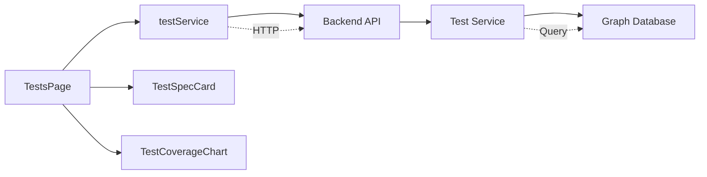

# Design Document: Test Page Implementation

## Overview

This design document describes the implementation of test management functionality on the Tests page. The implementation follows the established patterns from the Risks page, creating a frontend service layer (`testService.ts`) to communicate with the existing backend API, and updating the `TestsPage` component to provide full CRUD operations for test specifications and test runs.

The design leverages the existing backend infrastructure:
- Backend API endpoints at `/api/v1/tests/`
- Test service with complete business logic
- Graph database for test spec and test run storage
- Versioning, audit, and signature services

The frontend implementation will mirror the Risks page architecture:
- Service layer for API communication
- Card-based list view with filters
- Pagination support
- Modal-based forms for create/edit operations
- Coverage metrics dashboard

## Architecture

### Component Structure

```
frontend/src/
├── services/
│   ├── testService.ts          # New: API communication layer
│   └── index.ts                # Export testService
├── pages/
│   └── TestsPage.tsx           # Updated: Full test management UI
└── components/
    └── tests/
        ├── TestSpecCard.tsx    # Existing: Display test spec summary
        ├── TestSpecList.tsx    # Existing: List of test spec cards
        └── TestCoverageChart.tsx # Existing: Coverage visualization
```

### Data Flow



### State Management

The TestsPage will manage the following state:
- `viewMode`: Current view ('list' | 'detail' | 'create' | 'edit' | 'runs')
- `testSpecs`: Array of test specifications
- `selectedTestId`: Currently selected test spec ID
- `filters`: Active filter criteria (test type, linked requirement)
- `pagination`: Current page and page size
- `coverage`: Test coverage metrics
- `isLoading`: Loading state for async operations
- `error`: Error messages for user feedback

## Components and Interfaces

### testService.ts

The test service provides functions for all test-related API operations. It follows the same pattern as `riskService.ts`.

#### Type Definitions

```typescript
export type TestType = 'unit' | 'integration' | 'system' | 'acceptance' | 'regression';
export type ExecutionStatus = 'pass' | 'fail' | 'blocked' | 'not_run';
export type StepExecutionStatus = 'pass' | 'fail' | 'blocked' | 'skipped' | 'not_run';

export interface TestStep {
  step_number: number;
  description: string;
  expected_result: string;
  status: StepExecutionStatus;
  actual_result?: string;
  notes?: string;
}

export interface TestSpec {
  id: string;
  title: string;
  description?: string;
  test_type: TestType;
  priority?: number;
  preconditions?: string;
  test_steps: TestStep[];
  linked_requirements: string[];
  version: string;
  created_by: string;
  created_at: string;
  updated_at: string;
  is_signed: boolean;
}

export interface TestSpecCreate {
  title: string;
  description?: string;
  test_type: TestType;
  priority?: number;
  preconditions?: string;
  test_steps: TestStep[];
  linked_requirements: string[];
}

export interface TestSpecUpdate {
  title?: string;
  description?: string;
  test_type?: TestType;
  priority?: number;
  preconditions?: string;
  test_steps?: TestStep[];
  linked_requirements?: string[];
}

export interface TestRun {
  id: string;
  test_spec_id: string;
  test_spec_version: string;
  executed_by: string;
  execution_date: string;
  environment?: string;
  test_data?: Record<string, any>;
  overall_status: ExecutionStatus;
  step_results: TestStep[];
  failure_description?: string;
  defect_workitem_ids: string[];
  execution_notes?: string;
  created_at: string;
  updated_at: string;
  is_signed: boolean;
}

export interface TestRunCreate {
  test_spec_id: string;
  test_spec_version: string;
  executed_by: string;
  execution_date?: string;
  environment?: string;
  test_data?: Record<string, any>;
  overall_status: ExecutionStatus;
  step_results: TestStep[];
  failure_description?: string;
  defect_workitem_ids?: string[];
  execution_notes?: string;
}

export interface TestRunUpdate {
  environment?: string;
  test_data?: Record<string, any>;
  overall_status?: ExecutionStatus;
  step_results?: TestStep[];
  failure_description?: string;
  defect_workitem_ids?: string[];
  execution_notes?: string;
}

export interface TestCoverage {
  total_requirements: number;
  requirements_with_tests: number;
  requirements_with_passing_tests: number;
  coverage_percentage: number;
  detailed_coverage: Array<{
    requirement_id: string;
    requirement_title: string;
    has_tests: boolean;
    has_passing_tests: boolean;
    coverage_status: 'covered' | 'partial' | 'not_covered';
  }>;
}

export interface TestSpecListResponse {
  items: TestSpec[];
  total: number;
  page: number;
  size: number;
  pages: number;
}

export interface TestRunListResponse {
  items: TestRun[];
  total: number;
  page: number;
  size: number;
  pages: number;
}

export interface TestFilters {
  page?: number;
  size?: number;
  test_type?: TestType;
  linked_requirement_id?: string;
}
```

#### Service Functions

```typescript
// Get test specifications with filtering and pagination
export async function getTestSpecs(filters?: TestFilters): Promise<TestSpecListResponse>

// Get a specific test specification by ID
export async function getTestSpec(testSpecId: string): Promise<TestSpec>

// Get test coverage metrics
export async function getTestCoverage(): Promise<TestCoverage>

// Create a new test specification
export async function createTestSpec(testSpecData: TestSpecCreate): Promise<TestSpec>

// Update an existing test specification
export async function updateTestSpec(
  testSpecId: string,
  updates: TestSpecUpdate,
  changeDescription: string
): Promise<TestSpec>

// Delete a test specification
export async function deleteTestSpec(testSpecId: string): Promise<void>

// Create a test run for a test specification
export async function createTestRun(
  testSpecId: string,
  testRunData: TestRunCreate
): Promise<TestRun>

// Get test runs for a specific test specification
export async function getTestRuns(
  testSpecId: string,
  page?: number,
  size?: number
): Promise<TestRunListResponse>

// Update a test run
export async function updateTestRun(
  runId: string,
  updates: TestRunUpdate
): Promise<TestRun>
```

### TestsPage Component

The TestsPage component manages the overall test management UI. It follows the same structure as RisksPage.

#### Component State

```typescript
interface TestsPageState {
  viewMode: 'list' | 'detail' | 'create' | 'edit' | 'runs';
  selectedTestId: string | null;
  testSpecs: TestSpec[];
  coverage: TestCoverage | null;
  filters: TestFilters;
  totalTests: number;
  totalPages: number;
  isLoading: boolean;
  error: string | null;
  showDeleteConfirm: boolean;
  testToDelete: TestSpec | null;
  isDeleting: boolean;
}
```

#### Component Methods

```typescript
// Load test specifications from API
async function loadTestSpecs(): Promise<void>

// Load test coverage metrics from API
async function loadCoverage(): Promise<void>

// Handle test specification card click
function handleTestClick(test: TestSpec): void

// Handle create button click
function handleCreateClick(): void

// Handle back to list navigation
function handleBackToList(): void

// Handle filter changes
function handleFilterChange(newFilters: Partial<TestFilters>): void

// Handle pagination
function handlePageChange(page: number): void

// Handle delete confirmation
function handleDeleteClick(test: TestSpec): void
async function handleConfirmDelete(): Promise<void>
function handleCancelDelete(): void
```

#### View Modes

1. **List View**: Display test specifications in cards with filters and pagination
2. **Detail View**: Show full test specification details (future implementation)
3. **Create View**: Form for creating new test specifications
4. **Edit View**: Form for updating existing test specifications
5. **Runs View**: List of test runs for a specific test specification

### TestSpecCard Component

The TestSpecCard component displays a summary of a test specification. It already exists but may need updates.

#### Props

```typescript
interface TestSpecCardProps {
  testSpec: TestSpec;
  onClick: (testSpec: TestSpec) => void;
  onViewRuns?: (testSpecId: string) => void;
}
```

#### Display Elements

- Test title
- Test type badge
- Priority indicator
- Number of test steps
- Number of linked requirements
- Version number
- Signature status indicator
- Click handler for navigation

## Data Models

### Frontend Models

The frontend models mirror the backend Pydantic schemas but use TypeScript types:

#### TestSpec Model

```typescript
interface TestSpec {
  id: string;                    // UUID as string
  title: string;                 // 1-500 characters
  description?: string;          // Optional, max 2000 characters
  test_type: TestType;           // Enum: unit, integration, system, acceptance, regression
  priority?: number;             // Optional, 1-5 (1=highest)
  preconditions?: string;        // Optional, max 1000 characters
  test_steps: TestStep[];        // Array of test steps
  linked_requirements: string[]; // Array of requirement UUIDs
  version: string;               // Semantic version
  created_by: string;            // User UUID
  created_at: string;            // ISO 8601 timestamp
  updated_at: string;            // ISO 8601 timestamp
  is_signed: boolean;            // Signature status
}
```

#### TestStep Model

```typescript
interface TestStep {
  step_number: number;           // Sequential number starting from 1
  description: string;           // 1-1000 characters
  expected_result: string;       // 1-1000 characters
  status: StepExecutionStatus;   // Enum: pass, fail, blocked, skipped, not_run
  actual_result?: string;        // Optional, max 1000 characters
  notes?: string;                // Optional, max 2000 characters
}
```

#### TestRun Model

```typescript
interface TestRun {
  id: string;                    // UUID as string
  test_spec_id: string;          // Reference to test spec
  test_spec_version: string;     // Version of test spec executed
  executed_by: string;           // User UUID
  execution_date: string;        // ISO 8601 timestamp
  environment?: string;          // Optional, max 200 characters
  test_data?: Record<string, any>; // Optional test data
  overall_status: ExecutionStatus; // Enum: pass, fail, blocked, not_run
  step_results: TestStep[];      // Results for each step
  failure_description?: string;  // Required if status is 'fail'
  defect_workitem_ids: string[]; // Array of defect UUIDs
  execution_notes?: string;      // Optional, max 2000 characters
  created_at: string;            // ISO 8601 timestamp
  updated_at: string;            // ISO 8601 timestamp
  is_signed: boolean;            // Signature status
}
```

### API Request/Response Models

#### GET /api/v1/tests/

Request Query Parameters:
- `page`: number (default: 1)
- `size`: number (default: 50, max: 100)
- `test_type`: TestType (optional filter)
- `linked_requirement_id`: UUID string (optional filter)

Response: `TestSpecListResponse`

#### GET /api/v1/tests/coverage

Response: `TestCoverage`

#### POST /api/v1/tests/

Request Body: `TestSpecCreate`
Response: `TestSpec`

#### GET /api/v1/tests/{test_spec_id}

Response: `TestSpec`

#### PATCH /api/v1/tests/{test_spec_id}

Request Query Parameters:
- `change_description`: string (required)

Request Body: `TestSpecUpdate`
Response: `TestSpec`

#### DELETE /api/v1/tests/{test_spec_id}

Response: 204 No Content

#### POST /api/v1/tests/{test_spec_id}/runs

Request Body: `TestRunCreate`
Response: `TestRun`

#### GET /api/v1/tests/{test_spec_id}/runs

Request Query Parameters:
- `page`: number (default: 1)
- `size`: number (default: 50, max: 100)

Response: `TestRunListResponse`

#### PATCH /api/v1/tests/runs/{run_id}

Request Body: `TestRunUpdate`
Response: `TestRun`


## Correctness Properties

*A property is a characteristic or behavior that should hold true across all valid executions of a system—essentially, a formal statement about what the system should do. Properties serve as the bridge between human-readable specifications and machine-verifiable correctness guarantees.*

### Property Reflection

After analyzing all acceptance criteria, I identified several areas where properties can be consolidated:

1. **Service Function Existence (1.1-1.9)**: All these criteria test that service functions exist and work correctly. These can be combined into comprehensive integration tests rather than separate properties.

2. **UI Rendering Properties (5.1-5.7)**: All these criteria test that test spec cards display specific fields. These can be combined into a single property that validates complete card rendering.

3. **Form Field Rendering (6.2, 9.6)**: These test that forms contain required fields. These are better tested as examples rather than properties.

4. **Error Display (6.5, 7.7, 8.5, 9.9, 10.6, 11.3)**: All these test that errors are displayed. These can be combined into a single property about error handling.

### Properties

**Property 1: Service API Integration**
*For any* valid test service function call with appropriate parameters, the function should successfully communicate with the backend API and return data matching the expected response schema.
**Validates: Requirements 1.1, 1.2, 1.3, 1.4, 1.5, 1.6, 1.7, 1.8, 1.9**

**Property 2: Error Propagation**
*For any* test service function call that results in an API error, the error should be propagated to the caller without being swallowed.
**Validates: Requirements 1.10**

**Property 3: Pagination Behavior**
*For any* page number change in the test list view, the component should fetch test specifications with the correct offset and limit parameters.
**Validates: Requirements 2.6, 2.7**

**Property 4: Filter Application**
*For any* filter change (test type or linked requirement), the component should fetch test specifications with the filter parameters and reset pagination to page 1.
**Validates: Requirements 3.3, 3.4**

**Property 5: Filter State Display**
*For any* active filter, the filter controls should reflect the current filter values in the UI.
**Validates: Requirements 3.5**

**Property 6: Test Card Rendering**
*For any* test specification, the test card should display all required fields: title, test type, priority, test steps count, linked requirements count, version, and signature status.
**Validates: Requirements 5.1, 5.2, 5.3, 5.4, 5.5, 5.6, 5.7**

**Property 7: Card Click Navigation**
*For any* test specification card click, the component should navigate to the detail view with the correct test ID.
**Validates: Requirements 5.8**

**Property 8: Form Submission**
*For any* valid form submission (create or edit), the component should call the appropriate service function with the form data.
**Validates: Requirements 6.3, 7.4, 9.7, 10.4**

**Property 9: Successful Operation Handling**
*For any* successful create, update, or delete operation, the component should navigate appropriately and refresh the relevant data.
**Validates: Requirements 6.4, 7.6, 8.4, 9.8, 10.5**

**Property 10: Error Display**
*For any* failed operation (create, update, delete, fetch), the component should display an error message to the user.
**Validates: Requirements 6.5, 7.7, 8.5, 9.9, 10.6, 11.3**

**Property 11: Loading State Display**
*For any* asynchronous operation in progress, the component should display a loading indicator.
**Validates: Requirements 11.1**

**Property 12: Network Error Retry**
*For any* network error, the component should provide a retry option to the user.
**Validates: Requirements 11.5**

**Property 13: Test Run List Display**
*For any* test run in the test runs list, the component should display execution date, executed by, environment, and overall status.
**Validates: Requirements 9.3**

**Property 14: Edit Form Pre-population**
*For any* edit form (test spec or test run), the form fields should be pre-populated with the current entity data.
**Validates: Requirements 7.3, 10.3**

**Property 15: Change Description Requirement**
*For any* test specification update, the update request should include a change description parameter.
**Validates: Requirements 7.5**

## Error Handling

### Service Layer Error Handling

The test service will handle errors at multiple levels:

1. **Network Errors**: Catch and propagate network failures with descriptive messages
2. **HTTP Errors**: Parse error responses from the backend and extract error details
3. **Validation Errors**: Handle 400 Bad Request responses with validation error details
4. **Authorization Errors**: Handle 403 Forbidden responses
5. **Not Found Errors**: Handle 404 Not Found responses

Error handling pattern:
```typescript
try {
  const response = await apiClient.get<TestSpec>(`/api/v1/tests/${testSpecId}`);
  return response.data;
} catch (error) {
  if (axios.isAxiosError(error)) {
    if (error.response) {
      // Server responded with error status
      throw new Error(error.response.data.detail || 'Failed to fetch test specification');
    } else if (error.request) {
      // Request made but no response
      throw new Error('Network error: Unable to reach server');
    }
  }
  // Unknown error
  throw error;
}
```

### Component Error Handling

The TestsPage component will handle errors by:

1. **Displaying Error Messages**: Show user-friendly error messages in the UI
2. **Providing Retry Options**: Offer retry buttons for recoverable errors
3. **Logging Errors**: Log errors to console for debugging
4. **Maintaining State**: Keep the UI in a consistent state after errors

Error state management:
```typescript
const [error, setError] = useState<string | null>(null);

const handleError = (err: unknown) => {
  const message = err instanceof Error ? err.message : 'An unexpected error occurred';
  setError(message);
  console.error('TestsPage error:', err);
};

const clearError = () => setError(null);
```

### Validation Errors

Form validation will occur at two levels:

1. **Client-side Validation**: Validate form inputs before submission
   - Required fields
   - Field length limits
   - Format validation (e.g., test type enum values)
   - Test step sequential numbering

2. **Server-side Validation**: Backend validates all data
   - The frontend will display validation errors from the backend
   - Validation errors will be shown next to the relevant form fields

## Testing Strategy

### Unit Testing

Unit tests will verify individual functions and components in isolation:

**Test Service Unit Tests**:
- Mock axios/apiClient to test service functions
- Test request parameter construction
- Test response data transformation
- Test error handling and propagation
- Test helper functions (e.g., URL construction)

**Component Unit Tests**:
- Test component rendering with different props
- Test state management and updates
- Test event handlers
- Test conditional rendering (loading, error, empty states)
- Test filter and pagination logic

**Example Unit Tests**:
```typescript
describe('testService', () => {
  it('should fetch test specs with filters', async () => {
    // Mock API response
    // Call getTestSpecs with filters
    // Assert correct API call was made
    // Assert response data is returned
  });

  it('should propagate errors from API', async () => {
    // Mock API error
    // Call service function
    // Assert error is thrown
  });
});

describe('TestsPage', () => {
  it('should display loading state while fetching', () => {
    // Render component with isLoading=true
    // Assert loading indicator is visible
  });

  it('should display error message on fetch failure', () => {
    // Render component with error state
    // Assert error message is visible
  });

  it('should reset pagination when filter changes', () => {
    // Render component
    // Change filter
    // Assert page is reset to 1
  });
});
```

### Integration Testing

Integration tests will verify that components work correctly with the service layer:

**Service Integration Tests**:
- Test service functions against mock API server
- Test complete request/response cycles
- Test error scenarios with different HTTP status codes

**Component Integration Tests**:
- Test component with real service layer (mocked API)
- Test complete user workflows (create, edit, delete)
- Test navigation between views
- Test form submission and data refresh

**Example Integration Tests**:
```typescript
describe('TestsPage Integration', () => {
  it('should load and display test specs on mount', async () => {
    // Mock API to return test specs
    // Render TestsPage
    // Wait for data to load
    // Assert test specs are displayed
  });

  it('should create test spec and refresh list', async () => {
    // Mock API for create and list
    // Render TestsPage
    // Navigate to create view
    // Fill form and submit
    // Assert API was called
    // Assert list was refreshed
  });
});
```

### Property-Based Testing

Property-based tests will verify universal properties across many generated inputs:

**Configuration**:
- Use `fast-check` library for TypeScript property-based testing
- Run minimum 100 iterations per property test
- Tag each test with feature name and property number

**Property Tests**:

```typescript
import fc from 'fast-check';

describe('Property Tests: test-page-implementation', () => {
  // Property 1: Service API Integration
  it('Property 1: Service functions return valid response schemas', async () => {
    // Feature: test-page-implementation, Property 1
    await fc.assert(
      fc.asyncProperty(
        fc.record({
          page: fc.integer({ min: 1, max: 100 }),
          size: fc.integer({ min: 1, max: 100 }),
        }),
        async (filters) => {
          // Mock API with valid response
          const result = await getTestSpecs(filters);
          // Assert result matches TestSpecListResponse schema
          expect(result).toHaveProperty('items');
          expect(result).toHaveProperty('total');
          expect(result).toHaveProperty('page');
          expect(result).toHaveProperty('size');
          expect(result).toHaveProperty('pages');
        }
      ),
      { numRuns: 100 }
    );
  });

  // Property 6: Test Card Rendering
  it('Property 6: Test cards display all required fields', () => {
    // Feature: test-page-implementation, Property 6
    fc.assert(
      fc.property(
        fc.record({
          id: fc.uuid(),
          title: fc.string({ minLength: 1, maxLength: 500 }),
          test_type: fc.constantFrom('unit', 'integration', 'system', 'acceptance', 'regression'),
          priority: fc.integer({ min: 1, max: 5 }),
          test_steps: fc.array(fc.anything()),
          linked_requirements: fc.array(fc.uuid()),
          version: fc.string(),
          is_signed: fc.boolean(),
        }),
        (testSpec) => {
          // Render TestSpecCard with testSpec
          // Assert all fields are displayed
          const rendered = renderTestCard(testSpec);
          expect(rendered).toContain(testSpec.title);
          expect(rendered).toContain(testSpec.test_type);
          expect(rendered).toContain(testSpec.priority.toString());
          expect(rendered).toContain(testSpec.test_steps.length.toString());
          expect(rendered).toContain(testSpec.linked_requirements.length.toString());
          expect(rendered).toContain(testSpec.version);
        }
      ),
      { numRuns: 100 }
    );
  });
});
```

### Test Coverage Goals

- **Unit Test Coverage**: > 80% line coverage
- **Integration Test Coverage**: All major user workflows
- **Property Test Coverage**: All universal properties from design
- **Edge Case Coverage**: Empty states, error states, boundary conditions

### Testing Tools

- **Test Framework**: Jest (already used in the project)
- **React Testing**: React Testing Library
- **Property Testing**: fast-check
- **API Mocking**: MSW (Mock Service Worker) or axios-mock-adapter
- **Test Utilities**: @testing-library/user-event for user interactions

### Test Execution

Run tests with minimal verbosity:
```bash
npm test -- --silent
npm test -- --testNamePattern="testService" --silent
```

For property-based tests (which may take longer):
```bash
npm test -- --testNamePattern="Property Tests" --silent --maxWorkers=4
```
